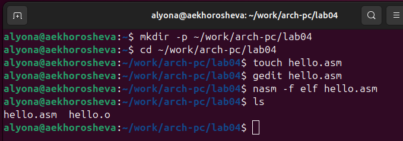
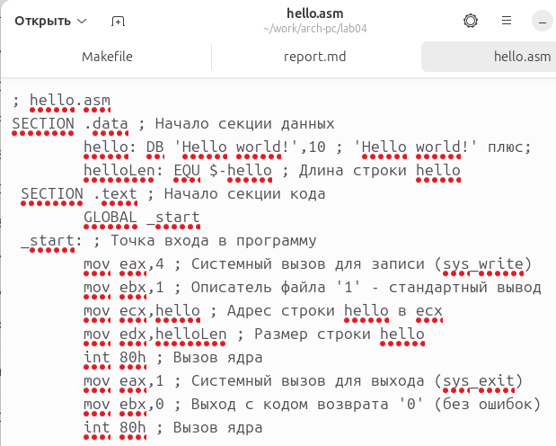
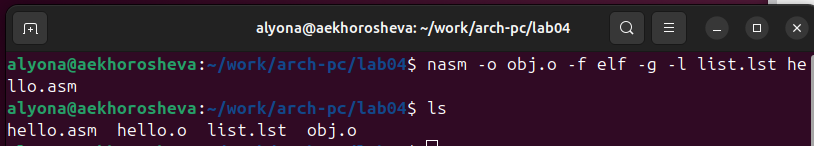
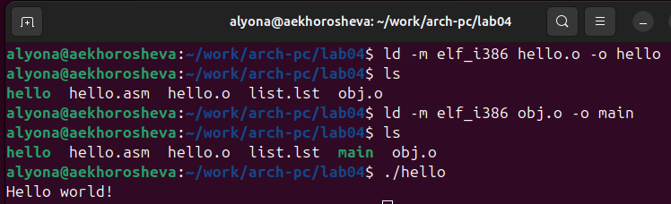
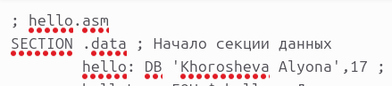
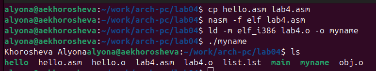

# Цель работы

Познакомиться с ассемблером NASM и освоить сборку программ для вывода текста на экран, компиляцию файлов.

# Задание

1. В каталоге ~/work/arch-pc/lab04 с помощью команды cp создайте копию файла
hello.asm с именем lab4.asm
2. С помощью любого текстового редактора внесите изменения в текст программы в
файле lab4.asm так, чтобы вместо Hello world! на экран выводилась строка с вашими фамилией и именем.
3. Оттранслируйте полученный текст программы lab4.asm в объектный файл. Выполните
компоновку объектного файла и запустите получившийся исполняемый файл.
4. Скопируйте файлы hello.asm и lab4.asm в Ваш локальный репозиторий в каталог ~/work/study/2023-2024/"Архитектура компьютера"/arch-pc/labs/lab04/.
Загрузите файлы на Github.

# Теоретическое введение
1.  	**Основные принципы работы компьютера**
	Основными функциональными элементами любой электронно-вычислительной машины (ЭВМ) являются центральный процессор, память и периферийные устройства. Взаимодействие этих устройств осуществляется через общую шину, к которой они подключены. Физически шина представляет собой большое количество проводников, соединяющих устройства друг с другом. В современных компьютерах проводники выполнены в виде электропроводящих дорожек на материнской (системной) плате.
	Основной задачей процессора является обработка информации, а также организация координации всех узлов компьютера. В состав центрального процессора (ЦП) входят следующие устройства:
* арифметико-логическое устройство (АЛУ) — выполняет логические и арифметиче-
ские действия, необходимые для обработки информации, хранящейся в памяти;
* устройство управления (УУ) — обеспечивает управление и контроль всех устройств
компьютера;
* регистры — сверхбыстрая оперативная память небольшого объёма, входящая в со-
став процессора, для временного хранения промежуточных результатов выполнения
инструкций; регистры процессора делятся на два типа: *регистры общего назначения* и *специальные регистры*.

	Другим важным узлом ЭВМ является **оперативное запоминающее устройство (ОЗУ)**. ОЗУ — это быстродействующее энергозависимое запоминающее устройство, которое напрямую взаимодействует с узлами процессора, предназначенное для хранения программ и данных, с которыми процессор непосредственно работает в текущий момент. ОЗУ состоит из одинаковых пронумерованных ячеек памяти. Номер ячейки памяти — это адрес хранящихся в ней данных.
	
	В состав ЭВМ также входят периферийные устройства, которые можно разделить на:
* устройства внешней памяти, которые предназначены для долговременного хране-
ния больших объёмов данных (жёсткие диски, твердотельные накопители, магнитные
ленты);

* устройства ввода-вывода, которые обеспечивают взаимодействие ЦП с внешней
средой.

	В основе вычислительного процесса ЭВМ лежит **принцип программного управления**. Это означает, что компьютер решает поставленную задачу как последовательность действий,
записанных в виде программы. Программа состоит из машинных команд, которые указывают, какие операции и над какими данными (или операндами), в какой последовательности необходимо выполнить.

	Набор машинных команд определяется устройством конкретного процессора. Коды команд представляют собой многоразрядные двоичные комбинации из 0 и 1. В коде машинной команды можно выделить две части: операционную и адресную. В операционной части хранится код команды, которую необходимо выполнить. В адресной части хранятся данные или адреса данных, которые участвуют в выполнении данной операции.
	
	При выполнении каждой команды процессор выполняет определённую последовательность стандартных действий, которая называется командным циклом процессора. В самом общем виде он заключается в следующем:
1. формирование адреса в памяти очередной команды;
2. считывание кода команды из памяти и её дешифрация;
3. выполнение команды;
4. переход к следующей команде.
Данный алгоритм позволяет выполнить хранящуюся в ОЗУ программу. Кроме того, в  зависимости от команды при её выполнении могут проходить не все этапы.

2.	**Ассемблер и язык ассемблера**
	Язык ассемблера (assembly language, сокращённо asm) — машинно-ориентированный язык низкого уровня. Можно считать, что он больше любых других языков приближен к архитектуре ЭВМ и её аппаратным возможностям, что позволяет получить к ним более полный доступ, нежели в языках высокого уровня, таких как C/C++, Perl, Python и пр. Заметим, что получить полный доступ к ресурсам компьютера в современных архитектурах нельзя, самым низким уровнем работы прикладной программы является обращение напрямую к ядру операционной системы. Именно на этом уровне и работают программы, написанные на ассемблере. Но в отличие от языков высокого уровня ассемблерная программа содержит только тот код, который ввёл программист. 
	Таким образом язык ассемблера — это язык, с помощью которого понятным для человека образом пишутся команды для процессора. Следует отметить, что процессор понимает не команды ассемблера, а последовательности из нулей и единиц — машинные коды. До появления языков ассемблера программистам приходилось писать программы, используя только лишь машинные коды, которые были крайне сложны для запоминания, так как представляли собой числа, записанные в двоичной или шестнадцатеричной системе счисления. Преобразование или трансляция команд с языка ассемблера в исполняемый машинный код осуществляется специальной программой транслятором — Ассемблер. 
	Программы, написанные на языке ассемблера, не уступают в качестве и скорости программам, написанным на машинном языке, так как транслятор просто переводит мнемонические обозначения команд в последовательности бит (нулей и единиц). Используемые мнемоники обычно одинаковы для всех процессоров одной архитектуры или семейства архитектур (среди широко известных — мнемоники процессоров и контроллеров x86, ARM, SPARC, PowerPC,M68k). 
	Таким образом для каждой архитектуры существует свой ассемблер и, соответственно, свой язык ассемблера.
Наиболее распространёнными ассемблерами для архитектуры x86 являются:
* для DOS/Windows: Borland Turbo Assembler (TASM), Microsoft Macro Assembler (MASM) и Watcom assembler (WASM);
* для GNU/Linux: gas (GNU Assembler), использующий AT&T-синтаксис, в отличие от большинства других популярных ассемблеров, которые используют Intel-синтаксис.

	В нашем курсе будет использоваться ассемблер NASM (Netwide Assembler). NASM — это открытый проект ассемблера, версии которого доступны под различные операционные системы и который позволяет получать объектные файлы для этих систем. В NASM используется Intel-синтаксис и поддерживаются инструкции x86-64.
Типичный формат записи команд NASM имеет вид:
[метка:] мнемокод [операнд {, операнд}] [; комментарий]
	Здесь **мнемокод** — непосредственно мнемоника инструкции процессору, которая является обязательной частью команды. **Операндами** могут быть числа, данные, адреса регистров или адреса оперативной памяти. **Метка** — это идентификатор, с которым ассемблер ассоциирует некоторое число, чаще всего адрес в памяти. Т.о. метка перед командой связана с адресом данной команды.
Допустимыми символами в метках являются буквы, цифры, а также следующие символы: _, $, #, @,~,. и ?.
Начинаться метка или идентификатор могут с буквы, ., _ и ?. Перед идентификаторами, которые пишутся как зарезервированные слова, нужно писать $, чтобы компилятор трактовал его верно (так называемое экранирование). Максимальная длина идентификатора 4095 символов.
Программа на языке ассемблера также может содержать **директивы** — инструкции, не переводящиеся непосредственно в машинные команды, а управляющие работой транслятора. Например, директивы используются для определения данных (констант и переменных) и oбычно пишутся большими буквами.

3. 	**Процесс создания и обработки программы на языке ассемблера**
В процессе создания ассемблерной программы можно выделить четыре шага:
- Набор текста программы в текстовом редакторе и сохранение её в отдельном файле. Каждый файл имеет свой тип (или расширение), который определяет назначение файла. Файлы с исходным текстом программ на языке ассемблера имеют тип asm.
- Трансляция — преобразование с помощью транслятора, например nasm, текста программы в машинный код, называемый объектным. На данном этапе также может быть получен листинг программы, содержащий кроме текста программы различную дополнительную информацию, созданную транслятором. Тип объектного файла — o, файла листинга — lst.
- Компоновка или линковка — этап обработки объектного кода компоновщиком (ld), который принимает на вход объектные файлы и собирает по ним исполняемый файл. Исполняемый файл обычно не имеет расширения. Кроме того, можно получить файл карты загрузки программы в ОЗУ, имеющий расширение map.
- Запуск программы. Конечной целью является работоспособный исполняемый файл. Ошибки на предыдущих этапах могут привести к некорректной работе программы, поэтому может присутствовать этап отладки программы при помощи специальной программы — отладчика. При нахождении ошибки необходимо провести коррекцию программы, начиная с первого шага. 
	Из-за специфики программирования, а также по традиции для создания программ на языке ассемблера обычно пользуются утилитами командной строки (хотя поддержка ассемблера есть в некоторых универсальных интегрированных средах)

# Выполнение лабораторной работы
1.	**Программа Hello world!**
	Создаю каталог lab04 для работы на языке ассемблера NASM. С помощью команды touch создаю там файл hello.asm. В тектовом редакторе gedit, скачанном предварительно, открываю этот файл и ввожу шаблон текста из предложенного материала для лабораторной работы. Каждую команду ввожу с новой строки, так как в ассемблере нельзя размещать несколько команд в одной строке.
	
 {width=70%}
 
 {}
 
2.	**Транслятор NASM**
	Компилирую текст написанной в файле hello.asm программы. Транслятор преобразует текст программы в объектный код и создаёт соответствующий файл hello.o. Далее проверяю наличие объектного файла в каталоге командой ls.
	
{}

3.	**Расширенный синтаксис командной строки NASM**
	С помощью команды на скриншоте ниже(см. пункт 5) компилирую файл hello.asm в obj.o, также создаётся файл листинга list.lst с помощью опции -l. Проверяю наличие созданных файлов командой ls.
	
4.	**Компоновщик LD**
	Командой ld объектный файл(hello.o) передаю на обработку компоновщику. Проверяю наличие исполняемого файла(это файл hello). Так же командой ld передаю компоновщику файл obj.o для создания исполняемого файла main.( скриншот см. пункт 5).

5.	**Запуск исполняемого файла**
	В терминале осуществляю запуск файла: ./hello. Здесь же на экран выводится результат выполнения программы, а именно текст "Hello world!".
	
{}

6.	**Задание для самостоятельной работы**
	Создаю копию файла hello.asm со сменой имени на lab04.asm. В текстовом редакторе открываю данный файл и меняю текст программы для вывода моей фамилии и имени, а именно пишу текст вместо "Hello World!" и указываю новую длину строки(17).
	
{}

	Создаю объектный файл и передаю туда файл с помощью команд ниже. Далее выполняю компоновку объектного файла. Теперь в терминале запускаю исполняемый и файл и получаю нужный результат - текст с фамилией и именем.
	
{}

# Выводы

	Поработав на языке ассемблера, я освоила навыки создания программы по шаблону и процесс для её запуска: транслятор в объектный файл и его дальнейшая компоновка, собственно сам запуск в командной строке.

# Список литературы{.unnumbered}

::: {#refs}
:::
